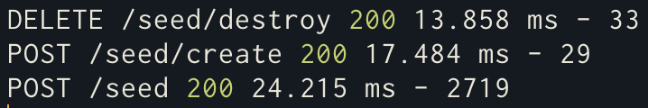
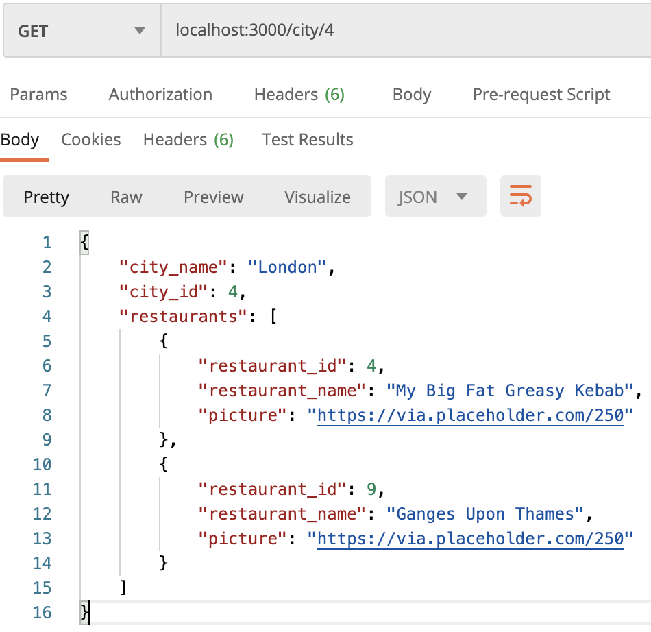
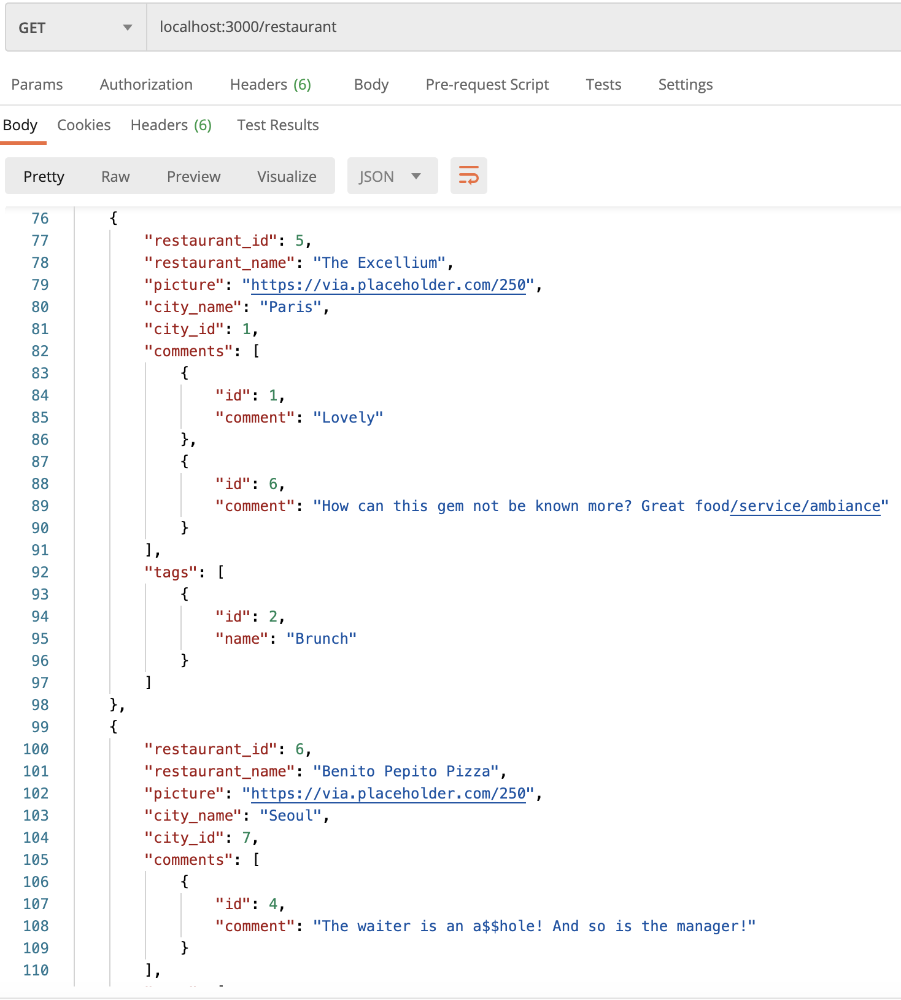
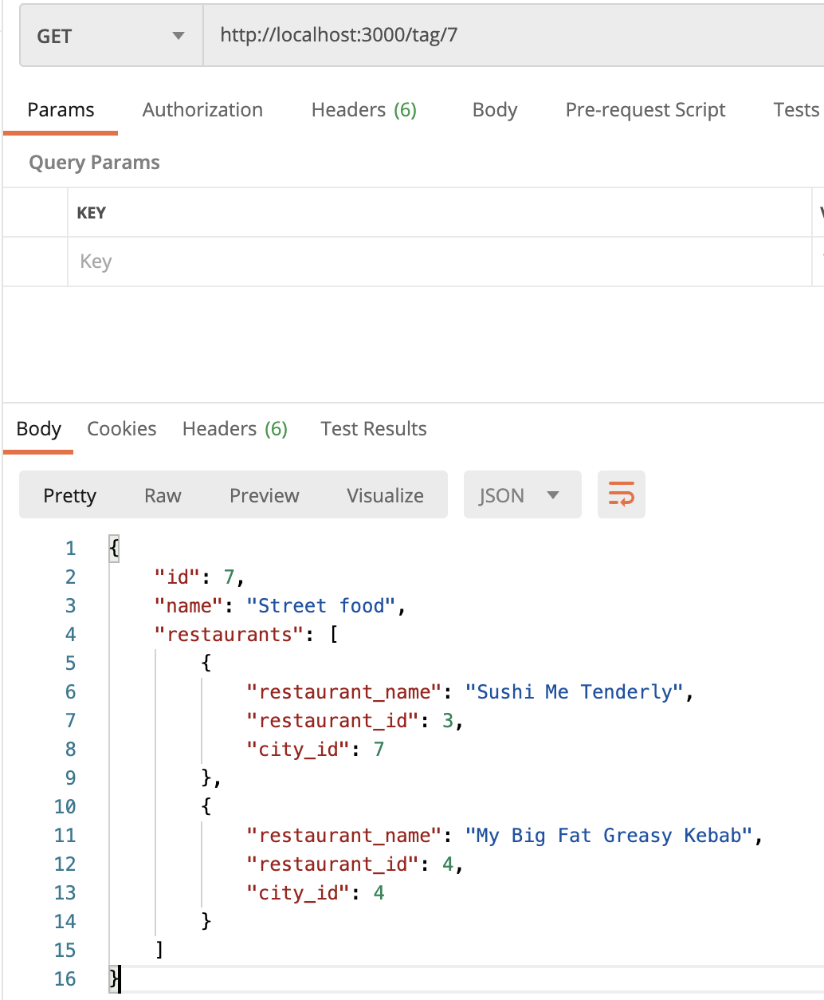

# Mini Yelp Workshop Correction

Clone this repo `mini-yelp` on your computer, then go into the folder with your terminal and execute:

```sh
npm install
```

### Step 1: Initialize the project

Create a database hosted on [Elephant SQL](https://www.elephantsql.com/)
Create a `.env` file at the root of the project

Put the database credentials provided by ElephantSQL into your .env file as such:
```
PGHOST=<Your database host>
PGUSER=<Your database user>
PGDATABASE=<Your database name>
PGPASSWORD=<Your database password>
PGPORT=5432
```

### Step 2: Create and seed the database

Before you can execute any commands; you need to initialize and seed some fake data into the database.

Fortunately, there's a `/seed` route for this!

_For this workshop we need a software called [Postman](https://www.postman.com/downloads/) or [Insomnia](https://insomnia.rest/), it will allow us to test our endpoints._
So fire up Postman (or Insomnia) and execute the following requests:

**POST** `localhost:3000/seed/create`  
then  
**POST** `localhost:3000/seed`  

You should see `Database successfully created` for the first command and the seeded data for the second.

If at any point after playing around with the database you need a clean slate; you can run:  
**DELETE** `localhost:3000/seed/destroy`

This will drop all tables. You can then redo the creation and the seeding accordingly to start fresh.



### Step 3: Make some queries

Now you can query the API :partying_face:

You could start by checking all the restaurants located in a city:  
**GET** `localhost:3000/city/4`  



or 

You could get all the restaurants with their associated data (comments/tags/city) as such:  
**GET** `localhost:3000/restaurant`  



You can control if you want to retrieve all the associated information for the restaurants by passing a JSON object in the body of your request:  

```JSON
{
    "comments": false,
    "tags": true
}
```

or  

You could search for all restaurants linked to a tag by sending the id of that tag:  
**GET** `http://localhost:3000/tag/7`  



This is not an exhaustive list.  

You're encouraged to check the controllers folder and check what you can do with the API! :nerd_face: